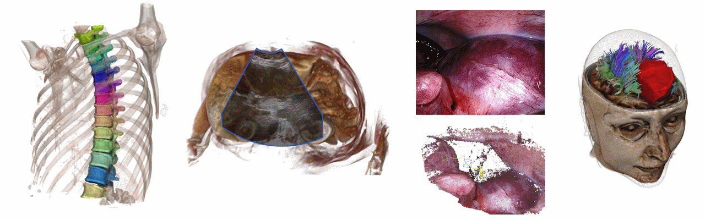

# Welcome to the GitHub page of ImFusion!

  

ImFusion is a certified company offering consulting, research and development in advanced medical image computing technologies and computer vision.

We publish here tutorials for the ImFusion SDK and code for our research papers.

## Tutorials & Demos for the ImFusion SDK

To get started, we recommend to check out one of the following repos:
* [public-demos](https://github.com/ImFusionGmbH/public-demos) for small example projects that can be built against the C++ ImFusion SDK. These projects are either standalone applications that demonstrate integrating the ImFusion SDK into custom applications or plugins that demonstrate how to extend the SDK with new functionality.
* [public-python-demos](https://github.com/ImFusionGmbH/public-python-demos) for demos highlighting the capabilities of our Python integrations (extend the ImFusion Suite with Python algorithms, or use the ImFusion algorithms from Python)
* [public-ultrasound-demos](https://github.com/ImFusionGmbH/public-ultrasound-demos) for demo datasets and accompanying workspace files that showcase core functionalities of the ImFusion Ultrasound plugin.

You will also find information in our [documentation](https://docs.imfusion.com) and tutorial videos on our [Youtube channel](https://www.youtube.com/@ImFusionGmbH).

## Research at ImFusion

The following repos contain code and/or data for some of our recently published research:

* [HyperSpace: Hypernetworks for spacing-adaptive image segmentation](https://github.com/ImFusionGmbH/HyperSpace) (MICCAI 2024)
* [2D-3D Deformable Image Registration of Histology Slide and Micro-CT with ML-based Initialization](https://github.com/ImFusionGmbH/Histology-to-microCT-registration)
* [DISA: DIfferentiable Similarity Approximation for Universal Multimodal Registration](https://github.com/ImFusionGmbH/DISA-universal-multimodal-registration) (MICCAI 2023)
* [Vertebra Keypoint association and filtering pipeline Dataset](https://github.com/ImFusionGmbH/VID-vertebra-identification-dataset) (MICCAI 2023)
* [PRO-TIP: Phantom for RObust automatic ultrasound calibration by TIP detection](https://github.com/ImFusionGmbH/PRO-TIP-Automatic-Ultrasound-Calibration) (MICCAI 2022)

You can also look for the tag [`imfusion-research`](https://github.com/topics/imfusion-research) on GitHub.

## Working at ImFusion

We are always excited to meet new talents and regularly hire software engineers and research scientists.

The current list of open positions is available [on this portal](https://imfusion.jobs.personio.com/).